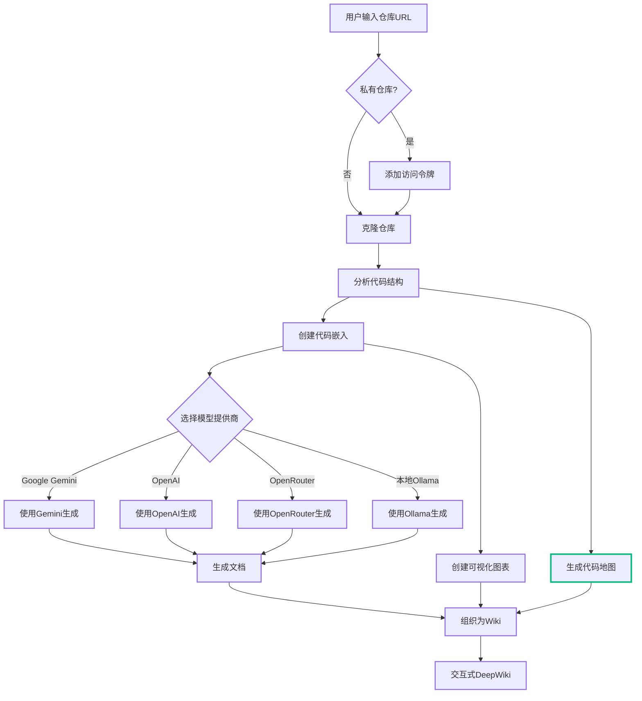

# 添加到主README.md的内容

## 在README.md的"特点"部分添加：

```markdown
- **代码地图**：交互式代码结构可视化，自动分析文件、类、函数及其依赖关系
```

## 在README.md的"工作原理"部分添加新步骤：

```markdown
8. 通过代码地图功能可视化项目结构和依赖关系
```

## 在README.md末尾添加新章节：

---

## 🗺️ 代码地图功能

DeepWiki 现在包含强大的**代码地图（Codemap）**功能，可以自动分析代码仓库并生成交互式的可视化图表。

### ✨ 主要功能

- **自动代码分析**：智能识别文件、类、函数、方法等代码元素
- **依赖关系可视化**：展示导入关系、调用关系、继承关系等
- **交互式探索**：搜索、过滤、缩放、拖拽，灵活浏览代码结构
- **一键导航**：点击节点直接跳转到源码文件
- **智能缓存**：生成一次，多次使用，提升效率
- **多语言深度支持**：
  - **Python**: 深度AST分析（类、函数、导入、继承）
  - **Java**: 深度解析（类、接口、枚举、方法、继承、实现）
  - **Go**: 深度解析（结构体、接口、函数、方法）
  - **JavaScript/TypeScript**: 基础文件级别分析

### 🎯 使用场景

- 📚 **快速理解项目**：新人快速掌握代码结构
- 🔍 **定位代码**：快速找到特定功能的实现位置
- 🏗️ **评估架构**：可视化系统设计和模块划分
- 🔄 **重构辅助**：识别代码依赖关系，安全重构
- 📖 **文档生成**：自动生成项目结构图

### 🚀 快速开始

1. 访问任意仓库的Wiki页面
2. 点击左侧导航的 **"代码地图"** 按钮
3. 点击 **"生成代码地图"**
4. 探索交互式代码可视化

### 📸 截图示例

```
[在此添加Codemap功能截图]
```

*交互式代码地图展示项目结构和依赖关系*

### 🎨 可视化元素

**节点类型**：
- 📁 Directory（目录）
- 📄 File（文件）
- 🧩 Class（类）
- ⚙️ Function（函数）
- 🔧 Method（方法）
- 📦 Module（模块）

**关系类型**：
- ➡️ Import（导入）
- 🔗 Call（调用）
- 🧬 Inherit（继承）
- ✅ Implement（实现）
- 📌 Reference（引用）

### 💡 高级功能

#### 搜索与过滤
```
🔍 搜索框：输入关键词实时过滤节点
☑️ 类型过滤：按节点类型筛选显示
🌐 语言过滤：按编程语言过滤
```

#### 交互操作
```
🖱️ 点击节点：跳转到源码文件
👆 拖拽节点：自定义布局
🔍 滚轮缩放：放大缩小视图
🗺️ 小地图：快速导航大型图表
```

#### 数据管理
```
💾 导出JSON：保存代码地图数据
🔄 重新生成：更新代码分析结果
🗑️ 清除缓存：删除旧的分析数据
```

### 📊 性能表现

| 项目规模 | 文件数 | 分析时间 | 内存占用 |
|---------|--------|---------|---------|
| 小型 | <100 | 5-15秒 | <100MB |
| 中型 | 100-1000 | 15-60秒 | 100-500MB |
| 大型 | >1000 | 1-5分钟 | 500MB-2GB |

### 🔧 配置选项

代码地图支持自定义配置：

```json
{
  "include_tests": false,    // 排除测试文件
  "max_depth": 5,            // 限制目录遍历深度
  "languages": ["python"]    // 只分析特定语言
}
```

### 📚 详细文档

- [设计文档](CODEMAP_DESIGN.md) - 架构和数据模型
- [使用指南](CODEMAP_USAGE.md) - 详细功能说明
- [快速开始](CODEMAP_QUICKSTART.md) - 30秒上手
- [安装测试](CODEMAP_INSTALLATION.md) - 完整测试流程

### 🎓 技术实现

**后端**：
- **Python AST解析器**（内置ast模块）：深度分析类、函数、导入
- **Java自定义解析器**（正则+模式匹配）：类、接口、枚举、方法、继承
- **Go自定义解析器**（正则+模式匹配）：结构体、接口、函数、方法
- 文件系统遍历和过滤
- 依赖关系提取（导入、继承、实现）
- 智能缓存机制

**前端**：
- React Flow可视化库
- 实时搜索和过滤
- 响应式布局
- 主题自适应

### 🌟 与现有功能集成

代码地图与DeepWiki其他功能无缝集成：

- **Wiki页面**：统一的导航和用户体验
- **Token管理**：自动支持私有仓库
- **缓存系统**：共享缓存基础设施
- **主题系统**：自动适配亮色/暗色主题
- **国际化**：支持多语言界面

### 🔮 未来计划

- [x] ~~支持更多编程语言（Java, Go）~~ ✅ 已完成
- [ ] 继续扩展语言支持（Rust, C++, C#等）
- [ ] AI辅助代码注释生成
- [ ] 代码变更热力图
- [ ] 依赖循环检测和建议
- [ ] 导出PNG/SVG图片
- [ ] 多仓库对比视图

---

**试试看**：访问 [演示站点](YOUR_DEMO_URL) 体验代码地图功能！
```

---

## 更新mermaid流程图（在"工作原理"章节）：

```markdown
## 🔍 工作原理

DeepWiki使用AI来：

1. 克隆并分析代码仓库（支持私有仓库）
2. 创建代码嵌入用于智能检索
3. 生成文档和可视化图表
4. 将所有内容组织成结构化Wiki
5. 提供智能问答功能
6. 支持深度研究功能
7. **生成交互式代码地图** ✨


```

---

## 添加到"截图"部分：

```markdown
### 代码地图视图


*交互式代码结构可视化 - 一目了然的项目架构*
```

