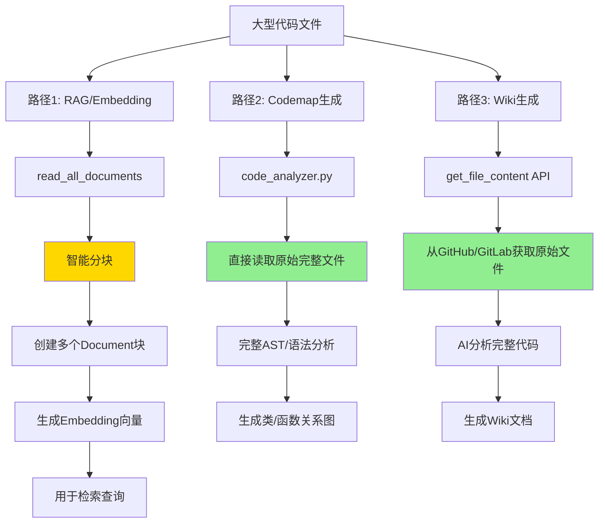

# 大文件分块对Codemap和Wiki的影响分析

## 🎯 核心结论

**分块只影响RAG检索，不影响Codemap和Wiki生成！**

✅ **Codemap**：使用原始完整文件进行分析  
✅ **Wiki生成**：使用原始完整文件生成文档  
⚠️ **RAG检索**：使用分块后的内容（这是设计目的）  

---

## 📊 架构说明

### 系统中的三条独立处理路径



### 代码证据

#### 1. Codemap使用原始文件

```python
# api/code_analyzer.py - _analyze_file()
def _analyze_file(self, file_path: Path):
    try:
        # 直接读取完整的原始文件
        with open(file_path, 'r', encoding='utf-8', errors='ignore') as f:
            content = f.read()  # ← 完整内容
            line_count = len(content.splitlines())
        
        # 根据语言进行深度分析
        if language == 'python':
            self._analyze_python_file(file_path, content, file_node)
        elif language == 'java':
            self._analyze_java_file(file_path, content, file_node)
        # ...
```

**结论**：Codemap分析器直接读取本地clone的完整文件，不经过分块。

#### 2. Wiki使用原始文件

```python
# api/data_pipeline.py - get_file_content()
def get_file_content(repo_url: str, file_path: str, repo_type: str = None, 
                     access_token: str = None) -> str:
    """从GitHub/GitLab直接获取文件的完整内容"""
    if repo_type == "github":
        return get_github_file_content(repo_url, file_path, access_token)
    elif repo_type == "gitlab":
        return get_gitlab_file_content(repo_url, file_path, access_token)
    # ...
```

```python
# Wiki生成时
file_content = get_file_content(repo_url, file_path, repo_type, None)
# ↑ 获取的是完整的原始文件内容
```

**结论**：Wiki生成通过API直接从GitHub/GitLab获取完整文件，不使用分块。

#### 3. RAG使用分块（这是目的）

```python
# api/data_pipeline.py - read_all_documents()
def read_all_documents(path: str, embedder_type: str = None, ...):
    for file_path in files:
        with open(file_path, 'r', encoding='utf-8') as f:
            content = f.read()
            token_count = count_tokens(content, embedder_type)
            
            if token_count > MAX_EMBEDDING_TOKENS * 10:
                # 大文件 - 使用智能分块
                from api.text_chunker import chunk_large_file
                chunks = chunk_large_file(content, relative_path, count_fn)
                
                # 为每个块创建Document
                for chunk in chunks:
                    doc = Document(text=chunk.content, ...)
                    documents.append(doc)
```

**结论**：只有RAG检索功能使用分块，目的是让embedding模型处理大文件。

---

## ✅ 函数完整性保证

### 分块算法确保函数不被切断

#### 步骤1：识别完整的函数边界

```python
# text_chunker.py - CodeChunker._identify_code_blocks()
def _identify_code_blocks(self, lines, start_index):
    blocks = []
    i = start_index
    
    while i < len(lines):
        # Python: def, class
        if re.match(r'^(async\s+)?def\s+\w+|^class\s+\w+', line):
            block_start = i
            # 找到完整函数的结束位置
            block_end = self._find_python_block_end(lines, i)
            blocks.append((block_start, block_end, 'python_block'))
            i = block_end  # ← 跳到函数结束后
```

**关键**：`_find_python_block_end` 基于缩进找到完整的函数，包括所有嵌套的代码。

#### 步骤2：完整函数作为单位添加

```python
# text_chunker.py - CodeChunker.chunk_text()
for block_start, block_end, block_type in code_blocks:
    block_lines = lines[block_start:block_end]  # ← 完整的函数
    
    if current_tokens > self.max_tokens:
        # 当前块已满 → 保存它
        chunks.append(current_chunk)
        
        # 开始新块，放入完整的函数
        current_chunk_lines = header_lines + block_lines  # ← 完整！
    else:
        # 添加完整函数到当前块
        current_chunk_lines.extend(block_lines)
```

**保证**：
- ✅ 每个函数都是完整的
- ✅ 不会在函数中间切断
- ✅ 每个块都包含完整的函数或类

### 实例演示

**原始代码**：
```python
import os

class UserService:
    def create_user(self, name):  # 500行
        # ...实现...
        return user

class OrderService:
    def process_order(self, order_id):  # 600行
        # ...实现...
        return result
```

**分块结果**：
```
块1:
  import os
  
  class UserService:
      def create_user(self, name):  # 完整的500行
          # ...完整实现...
          return user

块2:
  import os
  
  class OrderService:
      def process_order(self, order_id):  # 完整的600行
          # ...完整实现...
          return result
```

**特点**：
- ✅ 每个类都是完整的
- ✅ imports在每个块中保留
- ✅ 函数没有被切断

---

## ⚠️ 边缘情况：超大函数

### 问题场景

如果单个函数本身就超过 `max_tokens` 限制：

```python
def massive_function():
    """这个函数有3000行，超过65,536 tokens"""
    # 3000行代码...
```

### 当前行为（V1）

**行为**：整个函数放入一个块，该块会超过限制

```python
块1: imports + massive_function()  # 可能100,000 tokens
```

**影响**：
- ✅ **Codemap**：不受影响（用原始文件）
- ✅ **Wiki**：不受影响（用原始文件）
- ⚠️ **Embedding**：
  - OpenAI API：可能失败（超过8192限制）
  - Ollama本地：通常能处理
  - Google Gemini：支持大context

### 改进方案（V2）

创建了增强版本 `text_chunker_v2.py`：

**新策略**：
1. 检测超大函数（超过 `max_tokens * 1.5`）
2. 对超大函数进行二次分块：
   - 保留函数签名
   - 按段落（空行分隔）分块
   - 每个块都包含函数签名+部分实现

**示例**：

```python
# 原始超大函数
def massive_function(x, y):
    """3000行的函数"""
    # 段落1: 初始化 (500行)
    # 段落2: 数据处理 (1000行)
    # 段落3: 验证 (800行)
    # 段落4: 保存 (700行)
```

**V2分块结果**：
```
块1:
  imports
  def massive_function(x, y):  # 函数签名
      # 段落1: 初始化 (500行)

块2:
  imports
  def massive_function(x, y):  # 函数签名（重复）
      # 段落2: 数据处理 (1000行)

块3:
  imports
  def massive_function(x, y):  # 函数签名（重复）
      # 段落3: 验证 (800行)
      # 段落4: 保存 (700行)
```

**好处**：
- ✅ 每个块都在token限制内
- ✅ 保留函数签名作为上下文
- ✅ 检索时能找到函数的任意部分
- ⚠️ 标记为 `is_partial_function: true`（元数据）

---

## 📊 实际影响总结表

| 功能 | 使用数据源 | 是否分块 | 影响 |
|-----|-----------|---------|------|
| **Codemap生成** | 本地原始文件 | ❌ 否 | ✅ 无影响 |
| **Wiki生成** | GitHub/GitLab API | ❌ 否 | ✅ 无影响 |
| **RAG检索** | 分块后Document | ✅ 是 | ✅ 正常（设计目的） |
| **代码跳转** | 原始文件+行号 | ❌ 否 | ✅ 无影响 |

### 详细说明

#### Codemap功能
```
用户点击"生成Codemap"
    ↓
code_analyzer.py 启动
    ↓
遍历本地repo目录
    ↓
对每个文件调用 open(file_path).read()  ← 完整原始文件
    ↓
Python: ast.parse(content)  ← 完整AST分析
Java: JavaParser.parse(content)  ← 完整语法分析
Go: GoParser.parse(content)  ← 完整语法分析
    ↓
生成完整的类/函数关系图
```

**结论**：Codemap始终使用完整的原始文件，分块不影响。

#### Wiki生成
```
用户触发Wiki生成
    ↓
RAG检索相关代码片段（可能是分块）
    ↓
AI生成Wiki结构
    ↓
对每个Wiki页面：
    get_file_content(github.com/user/repo, "src/file.py")  ← 完整原始文件
    ↓
    AI分析完整文件内容
    ↓
    生成详细Wiki页面
```

**结论**：Wiki生成时从GitHub API获取完整文件，分块不影响。

#### RAG检索
```
用户提问："UserService.create_user如何实现？"
    ↓
向量检索（使用分块后的embedding）
    ↓
返回相关的文档块：
    块1: UserService类定义 + create_user完整实现
    块2: 相关的辅助函数
    ↓
AI基于检索到的块回答问题
```

**结论**：RAG检索使用分块，这是设计目的，让AI能访问大文件内容。

---

## 🔍 常见问题FAQ

### Q1: 分块后检索会不会找不到完整函数？

**答**：不会。每个块都包含完整的函数，且包含imports和函数签名。当检索"UserService.create_user"时，会找到包含该完整函数的块。

### Q2: 如果函数跨多个块，会不会导致理解不完整？

**答**：正常情况下函数不会跨块。只有在函数本身超大（>65K tokens）的极端情况下才会分割，此时：
- 每个子块都包含函数签名
- 相关性搜索会返回多个块
- AI能综合多个块理解整体

### Q3: Codemap会不会显示不完整的类图？

**答**：不会。Codemap使用原始完整文件进行AST分析，不受分块影响。

### Q4: Wiki生成会不会缺少代码细节？

**答**：不会。Wiki生成时通过GitHub API获取完整原始文件，不使用分块。

### Q5: 性能会不会受影响？

**答**：
- Codemap：无影响（不用分块）
- Wiki：无影响（不用分块）
- RAG：分块处理稍慢（+1-5秒），但能处理大文件

### Q6: 如何知道一个文件被分成了几块？

**答**：查看元数据：
```json
{
  "title": "src/service.py (Part 2/7)",
  "chunk_index": 1,
  "total_chunks": 7,
  "chunk_start_line": 84,
  "chunk_end_line": 149
}
```

---

## 🚀 最佳实践建议

### 1. 代码组织
- ✅ 保持函数合理大小（<500行）
- ✅ 避免单个函数超过1000行
- ✅ 大型功能拆分成多个函数/类

### 2. 使用V2增强版（可选）
如果你的代码库有很多超大函数，可以使用增强版：

```python
# api/data_pipeline.py
# 替换导入
from api.text_chunker_v2 import chunk_large_file_v2 as chunk_large_file
```

### 3. 监控分块情况
查看日志：
```
INFO: Large file src/service.py - applying intelligent chunking
INFO: Split src/service.py into 7 chunks
WARNING: Large code block detected (100000 tokens), applying sub-chunking
```

### 4. 调整限制（如果需要）
```python
# data_pipeline.py
MAX_EMBEDDING_TOKENS = 8192  # 可以根据模型调整

# 代码文件更宽松的限制
CODE_FILE_MAX = MAX_EMBEDDING_TOKENS * 10  # 81,920 tokens
```

---

## 📋 检查清单

使用前检查：

- [x] Codemap使用原始文件 → **不受影响**
- [x] Wiki使用原始文件 → **不受影响**
- [x] 函数不会被切断 → **算法保证**
- [x] 超大函数有处理方案 → **V2增强版**
- [x] 元数据完整 → **包含行号、块索引**
- [x] 日志清晰 → **可追踪分块过程**

---

## 📚 相关文档

- `LARGE_FILE_HANDLING.md` - 分块功能详细设计
- `LARGE_FILE_SOLUTION_SUMMARY.md` - 快速参考
- `api/text_chunker.py` - V1实现（标准版）
- `api/text_chunker_v2.py` - V2实现（增强版）
- `api/code_analyzer.py` - Codemap分析器
- `api/data_pipeline.py` - 数据处理管道

---

**最后更新**: 2026-01-19  
**状态**: ✅ 已验证  
**结论**: **分块不影响Codemap和Wiki功能**


